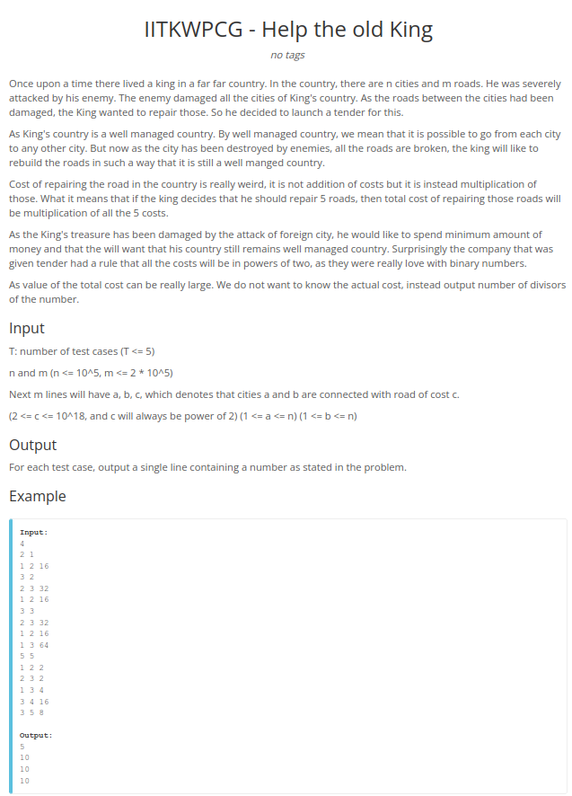

# Desafios Spoj

**Conteúdo da Disciplina**: Grafos 2 

## Alunos
|Matrícula | Aluno |
| -- | -- |
| 170122468  |  Nilvan Peres Costa |
| -  |  - |

## Sobre 
Esse projeto busca aplicar os conhecimentos adquiridos na matéria de Projeto de Algoritmos lecionada pelo professor Maurícion Serrano, através da resolução de problemas do site Code Force.

## Screenshots

### Exercício 1 - [Easy Dijkstra Problem](https://www.spoj.com/problems/EZDIJKST/)

- Descrição do problema:

- Logs de submissão:
#

### Exercício 2 - [Dark rodes](https://www.spoj.com/problems/ULM09/)
- Descrição do problema:

- Logs de submissão:

### Exercício 3 - [Help the old King](https://www.spoj.com/problems/IITKWPCG/)

- Descrição do problema:

- Logs de submissão:

## Instalação 
**Linguagem**: Python 3 
**Framework**: (caso exista) 
**Pré-requisitos**: Python 3.8 ou superior 

## Uso 

Para submeter as resoluções dos exercicíos basta seguir os passos abaixo:

1. Acesse a pasta do exercício desejado;

2. No arquivo 'explicacao.md' clique em link do problema;

3. O código fonte do problema que possui a extensão '.py';

4. No site do spoj, seleciona a linguagem Python 3.9.5 e selecione o arquivo com o código fonte, ou cole diretamente o código onde o site indica;

## Outros 
O vídeo pode ser acessado através do
[link](https://youtu.be/IGswi-Q-gBQ)

